# Домашнее задание к занятию «Безопасность в облачных провайдерах» - Лебедев В.В. FOPS-33 

Используя конфигурации, выполненные в рамках предыдущих домашних заданий, нужно добавить возможность шифрования бакета.

---
## Задание 1. Yandex Cloud   

1. С помощью ключа в KMS необходимо зашифровать содержимое бакета:

 - создать ключ в KMS;
 - с помощью ключа зашифровать содержимое бакета, созданного ранее.
2. (Выполняется не в Terraform)* Создать статический сайт в Object Storage c собственным публичным адресом и сделать доступным по HTTPS:

 - создать сертификат;
 - создать статическую страницу в Object Storage и применить сертификат HTTPS;
 - в качестве результата предоставить скриншот на страницу с сертификатом в заголовке (замочек).

Полезные документы:

- [Настройка HTTPS статичного сайта](https://cloud.yandex.ru/docs/storage/operations/hosting/certificate).
- [Object Storage bucket](https://registry.terraform.io/providers/yandex-cloud/yandex/latest/docs/resources/storage_bucket).
- [KMS key](https://registry.terraform.io/providers/yandex-cloud/yandex/latest/docs/resources/kms_symmetric_key).

--- 
## Решение 1

[Манифесты Terraform](https://github.com/ViktorLebedev93/orgnet-15.3hw/tree/main/terraform-yandex-lb)

Часть 1.

Вывод terraform

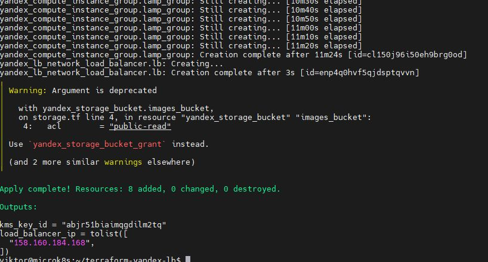

Проверяем создание ключа и настройки шифрования бакета

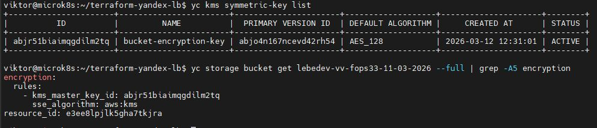

Проверяем доступ к картинке. Ответ HTTP/2 200 означает, что файл доступен
В заголовках ответа видно, что шифрование работает
```
x-amz-server-side-encryption: aws:kms
x-amz-server-side-encryption-aws-kms-key-id: abjr51biaimqgdilm2tq
```

Это означает, что файл расшифровывается автоматически при запросе, если у пользователя есть права доступа к бакету. Файл хранится в зашифрованном виде, но Yandex Cloud автоматически расшифровывает его при выдаче.

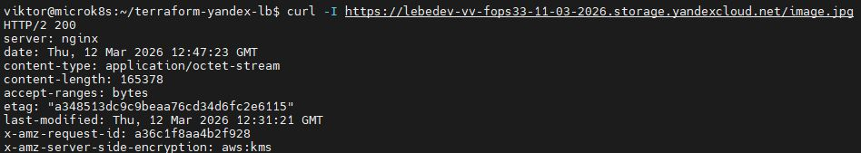

Часть 2.

 Создаём бакет с уникальным именем и включаем настройки веб-сайта

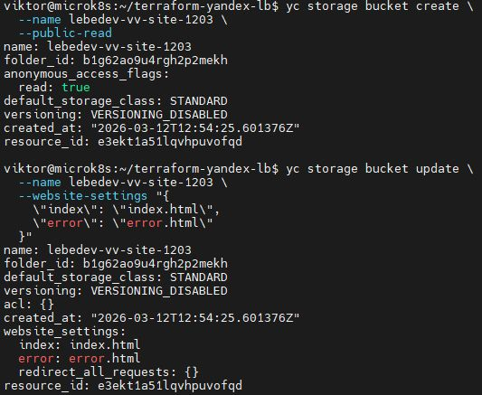

Загружаем домашние странички в бакет

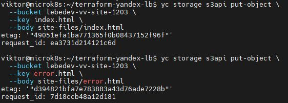

Проверяем доступ через curl

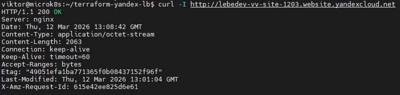

Создаем сертификат Lets'n'Crypt

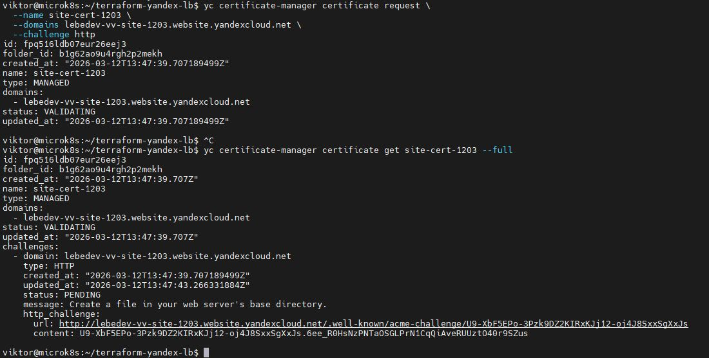

Сертификат успешно выпущен и валидирован

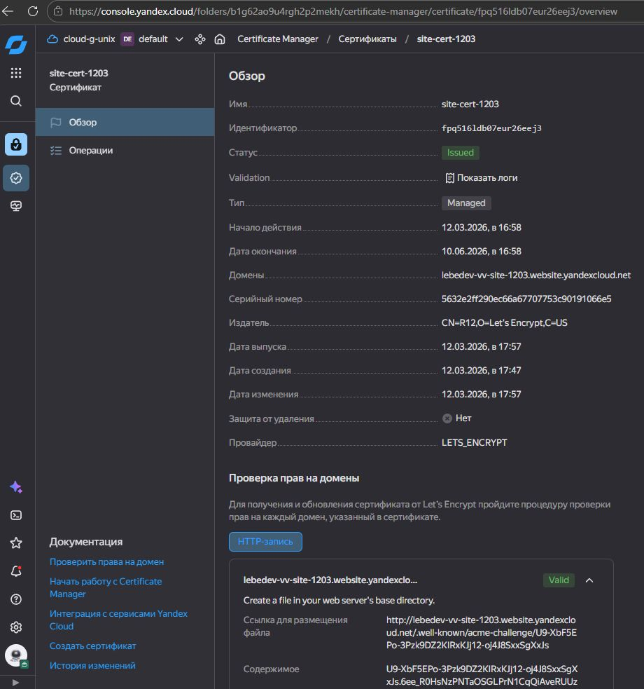

Включение HTTPS на бакете и проверка доступа по https через curl

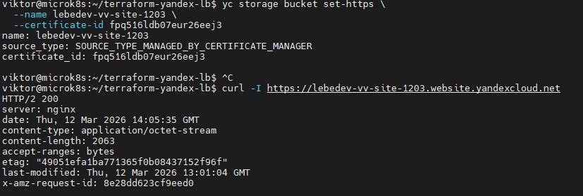

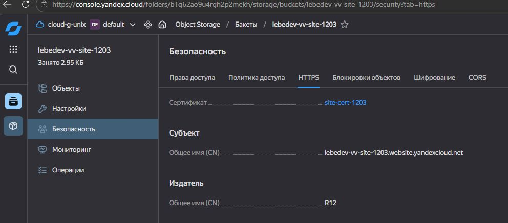

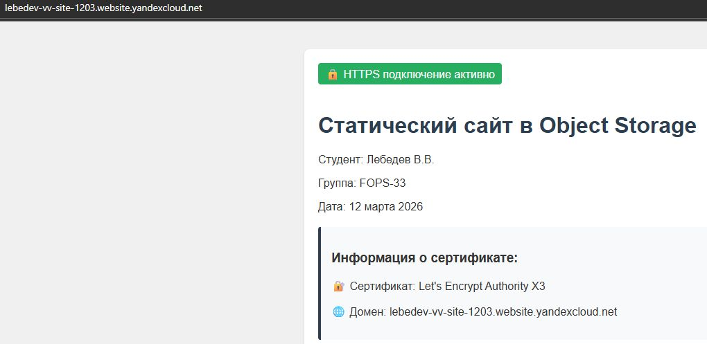

Resource Terraform:

- [IAM Role](https://registry.terraform.io/providers/hashicorp/aws/latest/docs/resources/iam_role).
- [AWS KMS](https://registry.terraform.io/providers/hashicorp/aws/latest/docs/resources/kms_key).
- [S3 encrypt with KMS key](https://registry.terraform.io/providers/hashicorp/aws/latest/docs/resources/s3_bucket_object#encrypting-with-kms-key).


### Правила приёма работы

Домашняя работа оформляется в своём Git репозитории в файле README.md. Выполненное домашнее задание пришлите ссылкой на .md-файл в вашем репозитории.
Файл README.md должен содержать скриншоты вывода необходимых команд, а также скриншоты результатов.
Репозиторий должен содержать тексты манифестов или ссылки на них в файле README.md.
